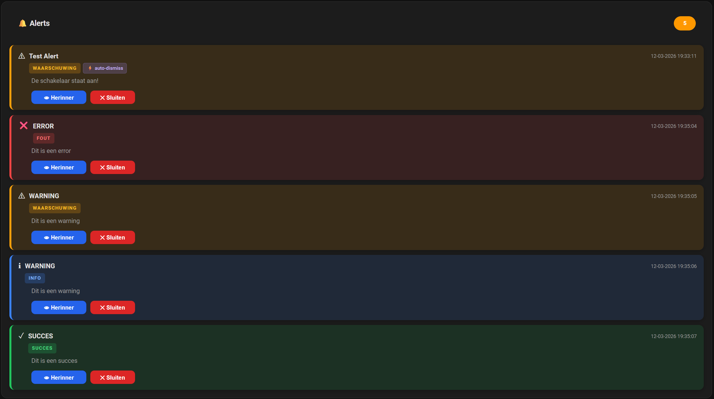

# HA Alert

HA Alert adds a persistent notification system to Home Assistant. When something goes wrong in your home, a pump failing, a window left open, a sensor reporting an unexpected value, you can create an alert from an automation. That alert stays visible on your dashboard until you dismiss it or until the situation resolves itself.

Home Assistant can send push notifications to your phone, but those disappear. HA Alert gives you a central place on your dashboard where you can see at a glance which alerts are active, which ones you have already seen, and which ones still need attention.

### What's included

**Backend integration**, registers three services in Home Assistant (`ha_alert.create`, `ha_alert.dismiss`, `ha_alert.acknowledge`) and provides a sensor (`sensor.ha_alert_active_alerts`) that tracks all active alerts.

**Lovelace dashboard card**, displays all active alerts in a styled card with color-coded alert types, timestamps, acknowledge and dismiss buttons, and optional badges for repeating or auto-dismissing alerts.

### Alert types

| Type | Color | When to use |
|---|---|---|
| `error` | 🔴 Red | Something is broken and needs immediate action |
| `warning` | 🟡 Yellow | Something needs attention but is not critical |
| `info` | 🔵 Blue | Neutral information, e.g. a task completed |
| `success` | 🟢 Green | Confirmation that something went well |

### Key features

- Alerts stay visible until explicitly dismissed or automatically resolved
- **Repeating alerts**, repeat every X minutes until dismissed, so nothing gets overlooked
- **Auto-dismiss**, link an alert to an entity; it disappears automatically when that entity reaches a target state
- **Acknowledge**, mark an alert as seen without dismissing it; resets automatically on the next repeat
- Works on all browsers and the iOS Home Assistant companion app

## 📸 Preview



---

**Integration version:** 2.2.1 | **Card version:** 1.2.4

## 📁 Installation

### Via HACS (recommended)

Click the button below to add HA Alert as a custom repository in HACS:

[](https://my.home-assistant.io/redirect/hacs_repository/?owner=bartjanisse&repository=ha-alert&category=integration)

Or add it manually:
1. Open HACS in Home Assistant
2. Click the three-dot menu (top right) and choose **Custom repositories**
3. Enter `https://github.com/bartjanisse/ha-alert` and select **Integration**
4. Click **Add**, search for **HA Alert** and install it
5. Restart Home Assistant

### Register the card

Add the following via **Settings → Dashboards → Resources** (three-dot menu, top right):

- URL: `/local/ha-alert-card.js`
- Type: `JavaScript module`

Or add it to `configuration.yaml`:

```yaml
lovelace:
  resources:
    - url: /local/ha-alert-card.js
      type: module
```

### Add the integration

Go to **Settings → Integrations → Add Integration** and search for **HA Alert**.

### Add the card to your dashboard

```yaml
type: custom:ha-alert-card
entity: sensor.ha_alert_active_alerts
title: My Alerts
```

---

## ⚠️ After an update

If the card does not load correctly after an update (especially on iOS / iPhone companion app), clear the frontend cache:

**iOS companion app:** Settings (gear icon) → Companion App → Troubleshooting → Clear frontend cache

**Browser:** Ctrl+Shift+R (hard refresh)

---

## 🗑️ Removing

1. Go to **Settings → Integrations**, click HA Alert and choose **Delete**
2. Go to **Settings → Dashboards → Resources** and remove `/local/ha-alert-card.js`
3. Remove the following files from your server:
   - `config/custom_components/ha_alert/`
   - `config/www/ha-alert-card.js`
4. Restart Home Assistant

---

## 🔧 Usage

### Service: `ha_alert.create`

```yaml
service: ha_alert.create
data:
  alert_type: error        # error | warning | info | success
  message: "Connection lost!"
  title: "Network"         # optional
  repeat_interval: 5       # optional: repeat every 5 minutes (value in minutes, 0-1440)
  repeat_until: "2025-12-31T23:59:59"  # optional
  condition_entity: sensor.temperature  # optional: auto-dismiss trigger entity
  condition_state: "normal"             # optional: state that triggers dismiss
```

### Service: `ha_alert.dismiss`

```yaml
service: ha_alert.dismiss
data:
  alert_id: alert_1642345678901_abc123
```

### Service: `ha_alert.acknowledge`

```yaml
service: ha_alert.acknowledge
data:
  alert_id: alert_1642345678901_abc123
```

---

## 🚀 Automation examples

### Low battery warning

```yaml
automation:
  - alias: "Low battery"
    trigger:
      platform: numeric_state
      entity_id: sensor.battery_level
      below: 20
    action:
      service: ha_alert.create
      data:
        alert_type: warning
        message: "Battery: {{ states('sensor.battery_level') }}%"
        title: "Low battery"
```

### Repeating alert for pump failure

```yaml
automation:
  - alias: "Pump failure notification"
    trigger:
      platform: state
      entity_id: binary_sensor.pump_status
      to: "off"
    action:
      service: ha_alert.create
      data:
        alert_type: error
        message: "Pump has failed!"
        title: "Pump failure"
        repeat_interval: 5
```

### Auto-dismiss on recovery

```yaml
automation:
  - alias: "High temperature alert"
    trigger:
      platform: numeric_state
      entity_id: sensor.temperature
      above: 30
    action:
      service: ha_alert.create
      data:
        alert_type: warning
        message: "Temperature too high: {{ states('sensor.temperature') }}°C"
        title: "High temperature"
        condition_entity: sensor.temperature
        condition_state: "normal"
```

---

## 📝 Changelog

### [2.2.0]
- Meets the Home Assistant Bronze quality scale
- Automated tests added (25 tests covering manager and config flow)
- `entry.runtime_data` used instead of `hass.data`
- Removal instructions added to README
- Brands (icon) added
- Bugfix: repeat interval now works correctly when `next_repeat` is exactly 0

### [2.1.1]
- Alert timestamps now include seconds (DD-MM-YYYY HH:MM:SS)

### [2.1.0]
- `repeat_interval` is now in minutes (0-1440) instead of seconds
- The value is converted to seconds internally
- The card badge now shows "every Xmin" instead of "every Xs"

### [2.0.0]
- Card fully rewritten in ES5 for maximum browser compatibility (iOS Safari / companion app)
- No more template literals, classes or arrow functions
- `-webkit-` prefixes added for all flexbox properties and animations
- `webkitAnimationEnd` fallback for ripple animation
- Integration and card version numbers aligned

### [1.1.0]
- Repeating alerts via `repeat_interval` and `repeat_until`
- Acknowledge functionality with local state
- Auto-dismiss via `condition_entity` / `condition_state`
- Manual dismiss service
- Dark semi-transparent background colors per alert type
- Inline badges for repeat and auto-dismiss

### [1.0.0]
- Initial release
